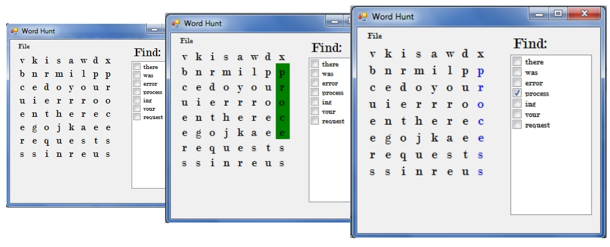

#Word Finder#

###**Class:** CS 275 &ndash; Interaction Programming.###

**Program Description:** Word Finder Application that loads different word puzzles from a saved text file and allows the user to select letters until a word is found.

**Comments:** I chose this code to display my ability of problem solving by narrowing down variables to simplify the ability to track the moves of the user based on the previous direction they had clicked on. Since Visual Basic does a lot of auto generated files it looks pretty busy in the directory but in fact the only file that is my original work is WordFinder.vb. If you look at that file and look at the Puzzle_Click method this was the meat and potatoes of the program.

This is the algorithm that used positioning of labels in the multidimensional array. If the position that the users click followed this pattern then you could determine the angle they were selecting letters in remained constant.

**To run:** This program is done in Visual Basic so sadly it can only be run on a Windows machine :(

1. Download and unzip [WordFinder.zip](https://drive.google.com/file/d/0Bwi6Jnp9m7pQaUh1TGthNHRTSFk/view?usp=sharing).
1. Open the WordFinder folder and run Assignment5.exe.
2. Click File > Open.
3. Select one of the .hnt files to load a game. 
4. Play.
