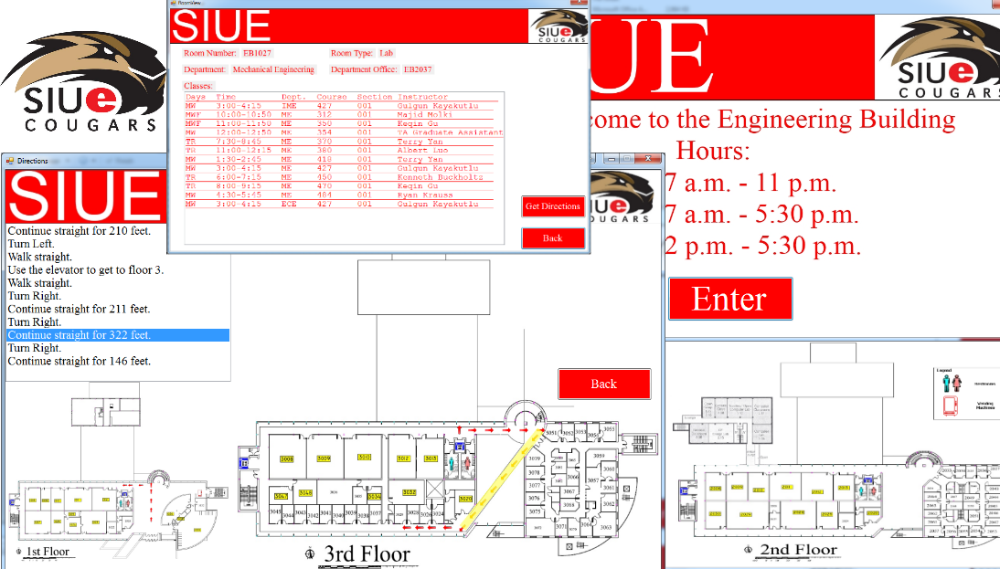

#Engineering Building Information Kiosk Software#

###**Class:** CS 321 &ndash; Human-Computer Interaction Design.###

**Program Description:** Team assignment where we implemented an interactive software application that would ultimately be installed on screen kiosks at every entrance of the SIUE Engineering building. The application provides visitors with information regarding the location in the building of each of the following:

- Office numbers for all faculty, staff, and administrators, including posted office hours for each individual.
- Room numbers for all laboratory facilities, including the name of the department in charge of the lab and the location of that department's main office.
- Room numbers and meeting times for all classes being conducted in the building during the current semester, Including instructor names and office room numbers.
- All restrooms and vending machines.

We also had to make a map of the engineering building. Since it was a touch kiosk we wanted to make it as interactive as possible to provide directions and put those directions on a map.

**Comments:** The primary challenge with this project was coordination with our team and our test subjects in the HCI Lab. Time management was crucial for this class. This project and this class forced many to come out of their shell in regards to working on teams since the size of the projects were too big for one person to take on by themselves. My team's name was Team Annex and I got along with my group pretty well. I put the project description called [Project Description.pdf](https://github.com/brianolsen87/SIUE-Projects/blob/master/CS%20321%20-%20Human-Computer%20Interaction%20Design/Team%20Annex/Project%20Description.pdf) that goes into detail of what was expected at each phase.

**To run:** This program is done in Visual Basic so sadly it can only be run on a Windows machine :(. 

1. Download [Team Annex.zip](https://drive.google.com/file/d/0Bwi6Jnp9m7pQRGZDMjBtUkdpdzA/view?usp=sharing)
2. Extract the file and open the Team Annex folder.
3. Double-click on TeamAnnex.exe.
4. You will need to choose a kiosk to indicate the location of the kiosk that the software is running on (The options won't make sense unless you're familiar with the SIUE Engineering building).
