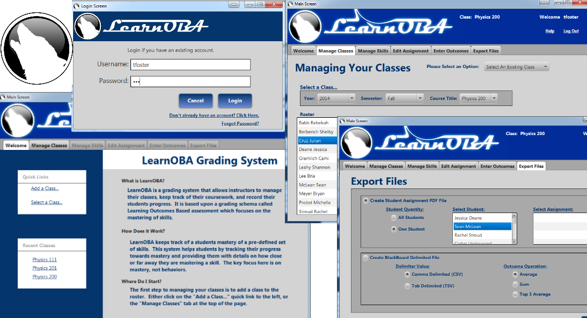

#LearnOBA: Senior Project#

###**Class:** CS 425 & CS 499 &ndash; Senior Project: Software Design &amp Software Implementation.###

**Program Description:** LearnOBA ([Learning Outcomes Based Assessment](http://en.wikipedia.org/wiki/Outcome-based_education "LearnOBA")) is a grading system that was designed to assist educators with maintaining a grade book that guided them to strictly adhere to the Learning Outcomes Bases Assessment paradigm.

**Comments:** The primary challenge with this project was getting the final builds multi-platform (OS X, Windows, and Linux). We wrote the software in Java to avoid redundant writing of code but still ran into many compliance issues in the end.

**To run:** This program was written in Java and we have compiled distributions for each of the popular operating system :). One thing to note, we only tested the Ubuntu Linux distribution. Make sure you have the latest Java version installed on your machine to run this!!

1. Download the distribution based on the operating system you use.
	1. [LearnOBA.exe (Windows)](https://drive.google.com/file/d/0Bwi6Jnp9m7pQRzcwa1gyOW9TSk0/view?usp=sharing).
	2. [LearnOBA.dmg (Mac)](https://drive.google.com/file/d/0Bwi6Jnp9m7pQcU5JZFpEWVhtYjA/view?usp=sharing).
	3. [LearnOBA.tar (Linux)](https://drive.google.com/file/d/0Bwi6Jnp9m7pQOHcwUnJOOFJUaHM/view?usp=sharing).
1. Open [LOBA-MANUAL R 1.0.pdf](https://github.com/brianolsen87/SIUE-Projects/blob/master/CS%20425%20%26%20499%20Senior%20Project%20-%20Software%20Design%20%26%20Implementation/LearnOBA/resources/LOBA-MANUAL%20R%201.0.pdf)

1. Follow the installation instructions listed in the PDF. The manual will also function as a guide to use the software.