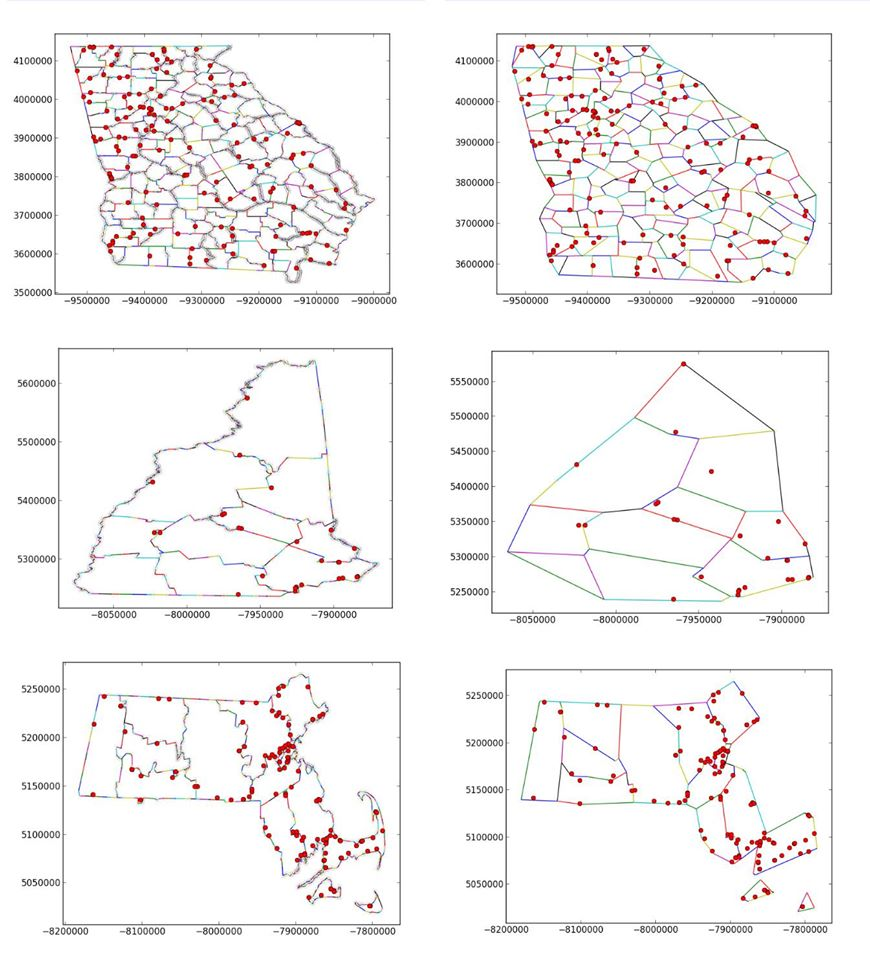

#Geometric Data Simplifier#

###**Class:** CS 490 &ndash; Advanced Database Topics###

**Program Description:** For our final homework assignment we were assigned to complete a project that could potentially be used for a computing competition called the [2014 SIG SPATIAL GIS Cup](http://mypages.iit.edu/~xzhang22/GISCUP2014/). We were then encouraged to revise and submit our program to the competition if our algorithm showed promise. That's exactly what I did. So I implemented the project in python for school and to get the algorithm worked out and finished for school. After school I rewrote the program in C and got it running much faster. Below is a description of the problem from the website.

Geometry generalization is a well known concept in the field of [cartography](http://en.wikipedia.org/wiki/Cartographic_generalization). This concept is used in producing maps with less detail according to map scale. The algorithms used for geometry generalization usually concentrate on the techniques for simplifying individual geometry objects. When these algorithms are applied to a map, the result might not be what the user expects.

Consider a map that displays a set of state boundaries at a very detailed level. Some states share boundaries with other states and the areas of the states do not overlap with each other. In addition, let's add a set of cities to the map. Some of these cities might be very close to the state boundaries. Now let us consider a simplified version of the same map. If geometry generalization algorithms are applied to each state boundary independently, the resulting map might not be accurate. For example, the simplified state boundaries might not align with each other exactly as they did before the simplification. Some of the cities that are very close to the state boundaries might now be in a different state if the simplified state boundary now falls on the other side of the point used to represent the city.  

To facilitate this type of map simplification, it is often desirable to break the state boundaries into different line geometries so that all shared boundaries are represented as unique line geometries. These lines are then simplified and connected back together to form the state boundaries. With this approach, the state boundaries will still preserve the non-overlapping property they had before the boundary is simplified. But this itself does not guarantee that the cities still maintain their relative position with respect to their state boundaries. 

This year's SIG Spatial competition explores this map generalization problem and challenges the students to come up with novel solutions for this very useful problem. The scope of the problem is limited to allow the students to develop a meaningful solution in a short amount of time.

**Problem Definition**

**INPUT:** A set of linear geometries that bound polygonal regions and a set of constraining points.

**OBJECTIVE:** Simplify the linear geometries such that the relationship between the constraining points and linear geometries before and after the simplification does not change. In addition, the topological relationships between the original set of input linear geometries does not change after the simplification.
												

**Comments:** The primary challenge with this project was coming up with a good algorithm and thinking through all the particular edge cases that would cause incorrect results. If you look in the Project 3/CS490 Project 3/BUGS/ folder you will find some pictures that display these issues. The next challenge once the school project was complete was to rewrite the program in C and make it better. My main goal was optimizing the file reading segment since that takes the longest.

**To run:** I'm only going to provide instructions to run the C version that should run on Windows and Linux. So sorry Mac. The python version is slower and requires numpy and some other math libraries...it's kind of a pain.

1. Download [Simplify.exe](https://drive.google.com/file/d/0Bwi6Jnp9m7pQT0NSSnM2a01pU0k/view?usp=sharing)
1. Download lines\_out.txt and points\_out.txt from any of the following state data sets. 
	1. [New Hampshire (Least Lines and Points)](https://drive.google.com/folderview?id=0Bwi6Jnp9m7pQVURpMWxWcWdQckE&usp=sharing)
	2. [Massachusetts](https://drive.google.com/folderview?id=0Bwi6Jnp9m7pQUTFtYVM2WGdiVUk&usp=sharing)
	3. [Georgia (Most Lines and Points)](https://drive.google.com/folderview?id=0Bwi6Jnp9m7pQbi1IbzJ4YXl0STg&usp=sharing)
1. In a prompt you will enter: Simplify [ PointToRemove ] [ LineInputFilePath ] [ PointInputFilePath ] [ OutputFilePath ]
	1. [ PointToRemove ] &ndash; Technically the minimum number of points to remove but my program removes the max every time so just pass a random integer.
	2. [ LineInputFilePath ] &ndash; Value to specify the location of the "lines_out.txt" file.
	3. [ PointInputFilePath ] &ndash; Value to specify the location of the "points_out.txt" file.
	4. [ OutputFilePath ] &ndash; Value to specify the location and name of the simplified lines file.

Now the lines file that is fed out by the program is the minimum amount of lines that don't violate topological constraints of the contest.