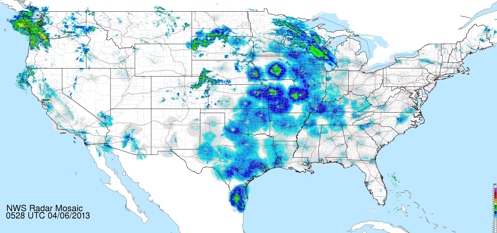
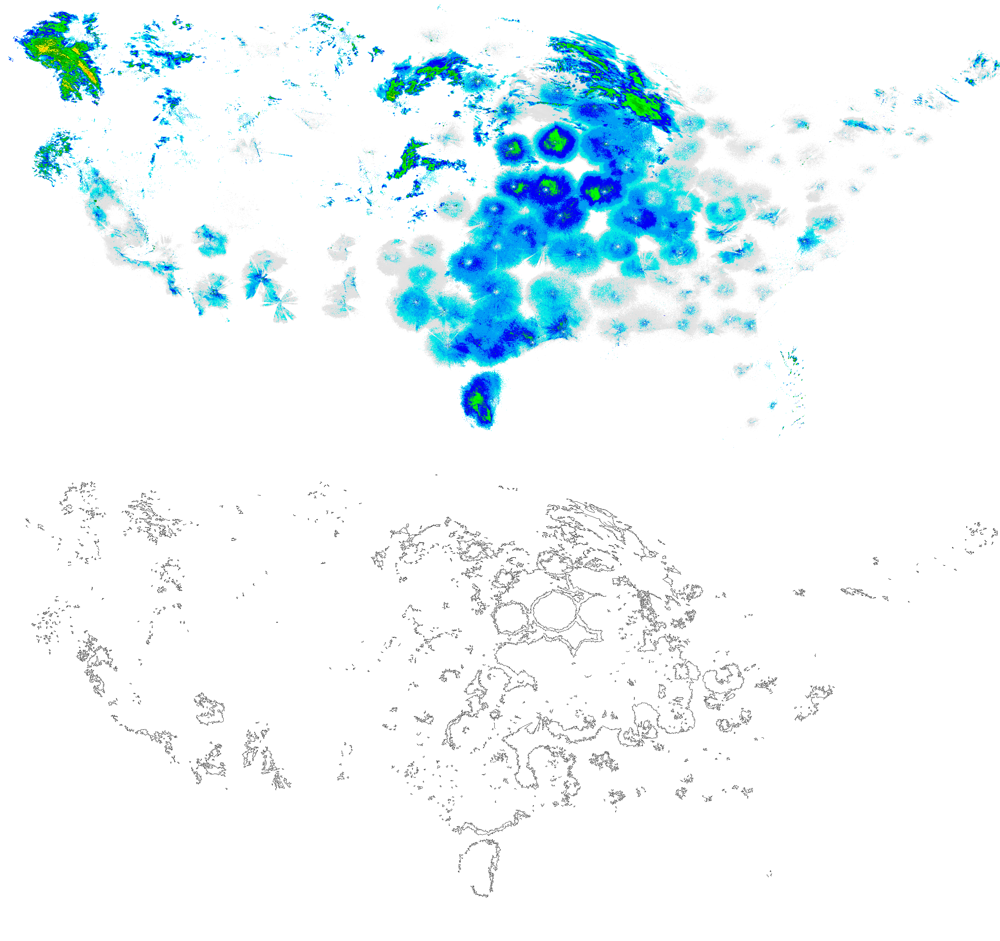
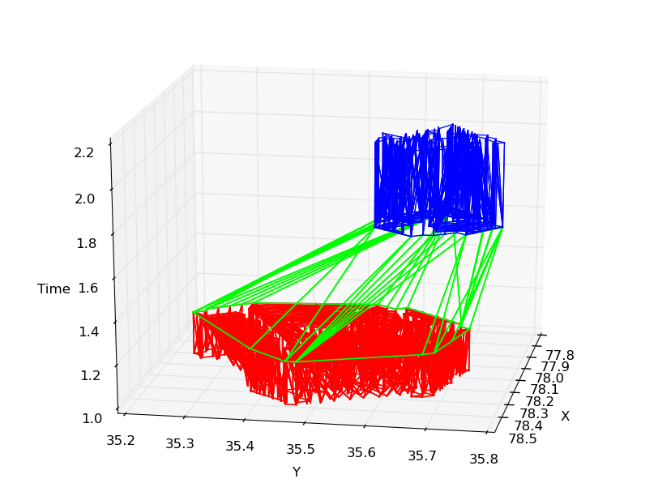
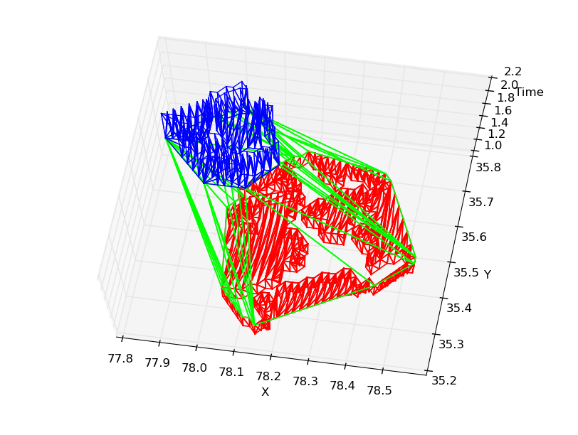
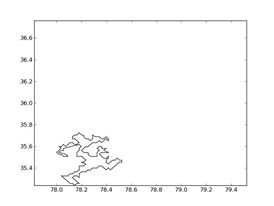

[<< Return to SIUE - Projects](https://github.com/brianolsen87/SIUE-Projects)
#Undergraduate Research#

###**Class:** CS 495 &ndash; Independent Study###

During undergraduate studies I conducted research with Dr. Mark McKenney. 

**Summary:** Our research focuses primarily on writing an analysis framework for spatiotemporal databases. This framework consists of a small subset of common aggregate operations, for example min, max, difference, etc. The algorithms are written in CUDA and are run on a GPU processor to 
optimize the speed of the queries. The information is stored in a database utilizing a map-reduced model to support efficient storage and retrieval of data. During my research I wrote programs that collect, analyze, and store storm information in the database. I also set up and administered our Linux based Hadoop cluster. We attended the 2013 COM.Geo conference in San Jose, CA where I presented a prototype and staged a poster of our work. The conference published our material to IEEE and is available on the IEEE Digital Library. The future work of this project focuses on enhancing our algorithms to handle the increasing size of our data.

		

My first task was writing the program that would pull weather data in the form of cloud reflectivity maps of the Continental U.S. (CONUS) from the [National Oceanic &amp Atmospheric Administration](http://forecast.weather.gov/jetstream/doppler/ridge_download.htm) better known as NOAA. 

At this point my program traced the edges of each cloud and singled out each individual decibel level areas (i.e. different colors on the map) that indicate different levels of [base reflectivity](http://forecast.weather.gov/jetstream/doppler/baserefl.htm).

For instance, notice the picture above shows the picture below only outlines the "Cyan" color that represents 10 dBZ that indicates a fairly low chance of precipitation.Distinguishing these values is important for the queries later in the process as it will allow us to query trends down to a exact point on the map. Every 10 minutes the weather data would be [updated](http://radar.weather.gov/ridge/Conus/RadarImg/latest_radaronly.gif) and my program would then fetch the next image to analyze and follow to perform the aforementioned process on the new data.

	

	

Once this occurs my program would then continue to link overlapping clouds in different time segments and associate the two individual regions as a single moving region. This moving region is stored as a binary file containing timestamps for each recorded region in time, as well as a boundary box to make a quick search for previous connecting regions and avoiding the need to instantiate all regions in order to associate individual static regions. 

In the end we have a multitude of static regions that can be interpolated (see video below) to account for the times in between. We call these sets of static regions a moving region. After we have the appended storms it is saved into the Hadoop Distributed File System.

				

My next responsibility was to perform a multi node hadoop cluster install. If you're not familiar 
with [hadoop technology](http://hadoop.apache.org/), it is an open source framework that facilitates parallel storage and retrieval over massive amounts of data also called <a href="http://en.wikipedia.org/wiki/Batch_processing" target="_blank">batch processing</a>. We can send special jobs called <a href = "http://hadoop.apache.org/docs/r1.2.1/mapred_tutorial.html" target="_blank">mappers and reducers</a> out to the cluster and perform programs that return data or some subset of the data we need depending on our operation. With this database we are able to use to store a massive amount of moving regions efficiently. I will provide a list of steps I went through to accomplish this set up and a list of references I used. You must note that this process 
is constantly changing and depending on what flavor of Linux you use and the version of hadoop you are using.